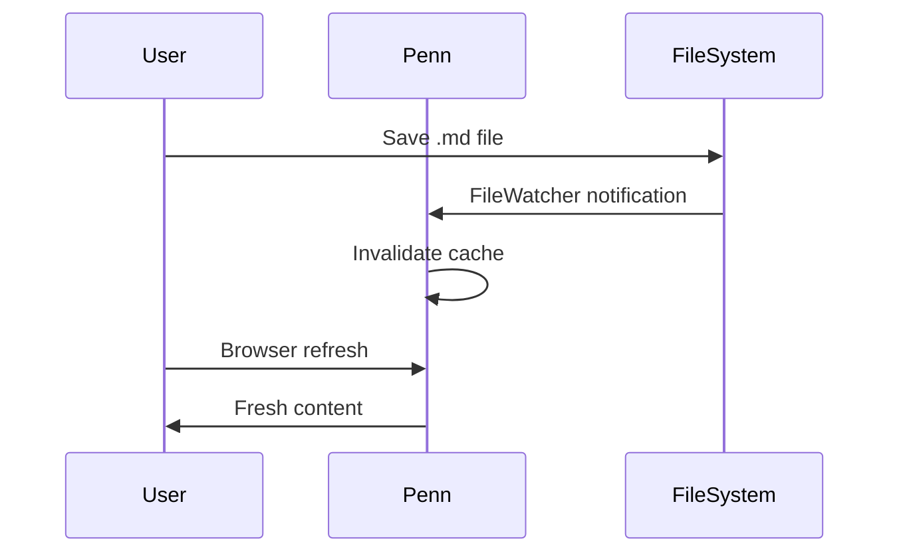

Penn uses [Markdig](https://github.com/xoofx/markdig) for Markdown processing, extended with its own collection of features that were deemed necessary and sufficient. These extensions generate HTML and CSS classes. If you're using `Penn.MonorailCss`, default styling is provided. If you're not, you'll be writing CSS. Penn won't apologize for either path.

## Code Highlighting

Penn highlights code blocks server-side based on the language specified in the opening fence. The <xref:T:Penn.Highlighting.ICodeHighlighter> pipeline follows a strict hierarchy, and the first highlighter that claims the language wins:

1. **TextMateSharp** -- If the language has a TextMate grammar available, `TextMateHighlighter` handles it. This covers most programming languages.
2. **Shell highlighter** -- For `bash` and `shell` code blocks, a built-in `ShellHighlighter` handles command and option highlighting.
3. **Custom highlighters** -- Any additional `ICodeHighlighter` implementations registered via `PennOptions.Highlighting.AddHighlighter<T>()`.
4. **Client-side fallback** -- If no server-side highlighter claims the block, the language attribute is preserved on the `<code>` element for optional client-side highlighting.

You can register additional highlighters in your `AddPenn` configuration:

```csharp
builder.Services.AddPenn(penn =>
{
    penn.Highlighting.AddHighlighter<MyCustomHighlighter>();
});
```

## Code Tabs

Tabbed code blocks let you show the same concept in multiple languages or formats. Place `tabs=true` on the first code fence, and subsequent consecutive code blocks become tabs. The `TabbedCodeBlocksExtension` handles grouping during Markdig's document processing phase.

``````markdown
```html tabs=true
<p>My Content</p>
```

```xml title="My XML Data"
<data>My Data</data>
```
``````

This will render as:

```html tabs=true
<p>My Content</p>
```

```xml title="My XML Data"

<data>My Data</data>
```

The `title` attribute on individual blocks overrides the default tab label (which is the language name). Code blocks within tabs are highlighted by the same pipeline described above. Penn does not play favorites.

## Code Directives

Penn's `CodeTransformer` supports Shiki-style code directives that annotate lines with visual effects. These use special comment notations -- `// [!code ...]` -- that are automatically stripped from the rendered output. The comment syntax works with any language's comment markers (`//`, `#`, `--`, `<!--`, etc.).

### Line Highlighting

Draw attention to specific lines with `// [!code highlight]` or `// [!code hl]`:

``````markdown
```javascript
function calculateSum(numbers) {
    let total = 0; // [!code highlight]
    for (const num of numbers) {
        total += num;
    }
    return total; // [!code hl]
}
```
``````

This will render as:

```javascript
function calculateSum(numbers) {
    let total = 0; // [!code highlight]
    for (const num of numbers) {
        total += num;
    }
    return total; // [!code hl]
}
```

### Diff Notation

Show additions and deletions with `// [!code ++]` and `// [!code --]`:

``````markdown
```javascript
function greetUser(name) {
    console.log("Hello " + name); // [!code --]
    console.log(`Hello ${name}!`); // [!code ++]
}
```
``````

This will render as:

```javascript
function greetUser(name) {
    console.log("Hello " + name); // [!code --]
    console.log(`Hello ${name}!`); // [!code ++]
}
```

### Error and Warning Indicators

Mark problematic lines with `// [!code error]` and `// [!code warning]`:

``````markdown
```javascript
function divide(a, b) {
    if (b = 0) { // [!code error]
        console.warn("Division by zero detected"); // [!code warning]
        return null;
    }
    return a / b;
}
```
``````

This will render as:

```javascript
function divide(a, b) {
    if (b = 0) { // [!code error]
        console.warn("Division by zero detected"); // [!code warning]
        return null;
    }
    return a / b;
}
```

### Focus and Blur

Use `// [!code focus]` to highlight specific lines and dim everything else. The `CodeTransformer` adds a `has-focused` class to the `<pre>` element and a `blurred` class to all non-focused lines:

``````markdown
```csharp
public async Task<User> GetUserAsync(int id)
{
  return await _repository.FindByIdAsync(id); // [!code focus]
}
```
``````

This will render as:

```csharp
public async Task<User> GetUserAsync(int id)
{
  return await _repository.FindByIdAsync(id); // [!code focus]
}
```

### Word Highlighting

Highlight specific tokens within a line using `// [!code word:token]`. Only the first occurrence on each line is highlighted, which prevents ambiguity:

``````markdown
```javascript
function processData(input) {
    const result = transform(input); // [!code word:transform]
    return result;
}
```
``````

This will render as:

```javascript
function processData(input) {
    const result = transform(input); // [!code word:transform]
    return result;
}
```

#### Word Highlighting with Tooltips

Add explanations using the pipe syntax `// [!code word:word|explanation]`:

``````markdown
```csharp
public void ConfigureServices(IServiceCollection services)
{
    services.AddScoped<IRepository, Repository>(); // [!code word:AddScoped|Registers service with scoped lifetime]
    services.AddTransient<IValidator, Validator>();
}
```
``````

This will render as:

```csharp
public void ConfigureServices(IServiceCollection services)
{
    services.AddScoped<IRepository, Repository>(); // [!code word:AddScoped|Registers service with scoped lifetime]
    services.AddTransient<IValidator, Validator>();
}
```

> [!TIP]
> Word highlighting with tooltips is useful for teaching -- draw attention to the method name that matters and explain it without cluttering the code.

### Snippet Regions

The `CodeTransformer` also supports include/exclude regions for showing partial code blocks. Use `// [!code include-start]` / `// [!code include-end]` to show only a region, or `// [!code exclude-start]` / `// [!code exclude-end]` to hide a region. These are processed before other directives and the directive lines themselves are removed from output.

## Enhanced Alerts

Penn tweaks Markdig's `AlertBlock` parsing via `CustomAlertInlineParser` to work with MonorailCSS and Tailwind styling. The parser recognizes GitHub-style alert syntax in blockquotes.

### Note

```markdown
> [!NOTE]  
> Highlights information that users should take into account, even when skimming.
```

> [!NOTE]  
> Highlights information that users should take into account, even when skimming.

### Tip

```markdown
> [!TIP]
> Optional information to help a user be more successful.
```

> [!TIP]
> Optional information to help a user be more successful.

### Important

```markdown
> [!IMPORTANT]  
> Crucial information necessary for users to succeed.
```

> [!IMPORTANT]  
> Crucial information necessary for users to succeed.

### Warning

```markdown
> [!WARNING]  
> Critical content demanding immediate user attention due to potential risks.
```

> [!WARNING]  
> Critical content demanding immediate user attention due to potential risks.

### Caution

```markdown
> [!CAUTION]
> Negative potential consequences of an action.
```

> [!CAUTION]
> Negative potential consequences of an action.

## Mermaid Diagrams

Penn supports [Mermaid](https://mermaid.js.org/) diagrams. If your site includes the Mermaid library, fenced code blocks with the `mermaid` language tag will be rendered as diagrams:



## The Markdown Pipeline

Penn's `MarkdownPipelineFactory.CreateWithExtensions` builds the Markdig pipeline with all extensions pre-configured: auto-identifiers (GitHub-style, required for sidebar heading links), custom alerts, tabbed code blocks, code transformation, and highlighting. You do not need to configure the pipeline manually. Penn has opinions about which extensions belong. You are welcome to have different opinions, elsewhere.
