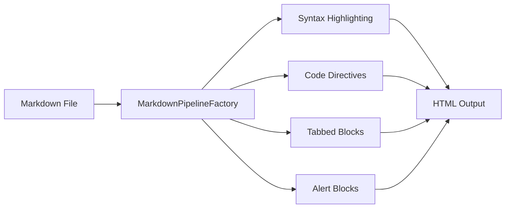

Penn processes Markdown through [Markdig](https://github.com/xoofx/markdig) and layers its own extensions on top for code highlighting, tabbed content, line-level code directives, enhanced alerts, and Mermaid diagrams. These extensions produce HTML with CSS classes that `Penn.MonorailCss` styles by default. If you bring your own CSS framework, target the same classes.

## Code Highlighting

Penn highlights fenced code blocks at build time on the server. No client-side JavaScript is required. `HighlightingService` dispatches each block to the highest-priority `ICodeHighlighter` that supports the requested language. Three highlighters ship with Penn:

| Highlighter | Priority | Languages |
|---|---|---|
| `ShellHighlighter` | 75 | `bash`, `shell`, `sh` |
| `TextMateHighlighter` | 50 | `*` (all languages via TextMate grammars) |
| `PlainTextHighlighter` | 0 | `*` (fallback, HTML-encodes only) |

Priority determines dispatch order. `ShellHighlighter` claims shell languages at priority 75 before `TextMateHighlighter` (priority 50) can. `PlainTextHighlighter` at priority 0 is the internal fallback used when no other highlighter matches; it HTML-encodes the code without adding syntax spans.

To register a custom highlighter, implement `ICodeHighlighter` and add it during service configuration:

```csharp
builder.Services.AddPenn(penn =>
{
    penn.Highlighting.AddHighlighter<MyRoslynHighlighter>();
});
```

Your highlighter's `Priority` property controls where it falls in the dispatch chain. Set it above 50 to override TextMate for specific languages, or above 75 to override the shell highlighter.

## Code Tabs

Tabbed code blocks group consecutive fenced blocks into a tabbed interface with ARIA-compliant tab navigation. Add `tabs=true` to the first fence's arguments. Every consecutive fenced code block that follows becomes a tab in the same group. The `TabbedCodeBlocksExtension` detects consecutive fenced blocks during Markdig's document processing phase and wraps them in a `TabbedCodeBlock` container.

``````markdown
```csharp tabs=true
Console.WriteLine("Hello from C#");
```

```python
print("Hello from Python")
```

```rust
println!("Hello from Rust");
```
``````

```csharp tabs=true
Console.WriteLine("Hello from C#");
```

```python
print("Hello from Python")
```

```rust
println!("Hello from Rust");
```

Only the first block needs `tabs=true`. Subsequent blocks join the group automatically until a non-code-block element (a paragraph, heading, or any other Markdown construct) breaks the sequence. A single code block with `tabs=true` but no following code blocks renders as a normal code block.

### Tab Titles

By default, the tab label is the human-readable language name derived from the fence's language identifier. Penn normalizes identifiers through `LanguageNormalizer`---`csharp` becomes "C#", `js` becomes "JavaScript", `ts` becomes "TypeScript", and so on.

Override the default label with the `title` argument:

``````markdown
```xml tabs=true title="App Config"
<configuration>
  <appSettings />
</configuration>
```

```json title="package.json"
{
  "name": "my-app"
}
```
``````

```xml tabs=true title="App Config"
<configuration>
  <appSettings />
</configuration>
```

```json title="package.json"
{
  "name": "my-app"
}
```

## Line Highlighting

All code directives follow the same pattern: a comment marker followed by `[!code directive]`. The `CodeTransformer` strips the directive from the rendered output and applies a CSS class to the affected line. Directives work with any comment syntax---`//`, `#`, `--`, `<!--`, `*`, `%`, `'`, `REM`, `;`, and `/*` are all recognized as comment markers.

Draw attention to specific lines with `// [!code highlight]` or the shorthand `// [!code hl]`. The directive comment is stripped from the rendered output and the line receives a `highlight` CSS class.

``````markdown
```csharp
public void Configure(IApplicationBuilder app)
{
    app.UseRouting(); // [!code highlight]
    app.UseAuthentication();
    app.UseAuthorization(); // [!code hl]
    app.MapControllers();
}
```
``````

```csharp
public void Configure(IApplicationBuilder app)
{
    app.UseRouting(); // [!code highlight]
    app.UseAuthentication();
    app.UseAuthorization(); // [!code hl]
    app.MapControllers();
}
```

The containing `<pre>` element receives a `has-highlighted` class, which enables you to dim non-highlighted lines via CSS if desired.

## Diff Notation

Show additions and removals with `// [!code ++]` and `// [!code --]`. Lines marked with `++` receive a `diff-add` class; lines marked with `--` receive `diff-remove`.

``````markdown
```javascript
function greet(name) {
    console.log("Hello " + name); // [!code --]
    console.log(`Hello, ${name}!`); // [!code ++]
}
```
``````

```javascript
function greet(name) {
    console.log("Hello " + name); // [!code --]
    console.log(`Hello, ${name}!`); // [!code ++]
}
```

The `<pre>` element receives a `has-diff` class when any diff directives are present. Diff notation is particularly useful for migration guides and changelog entries where you need to show what changed between versions.

## Focus

Use `// [!code focus]` to emphasize specific lines while blurring everything else. Every line without the focus directive receives a `blurred` CSS class, and the `<pre>` element receives `has-focused`.

``````markdown
```csharp
public class Startup
{
    public void ConfigureServices(IServiceCollection services)
    {
        services.AddPenn(penn => // [!code focus]
        { // [!code focus]
            penn.ContentRootPath = "Content"; // [!code focus]
        }); // [!code focus]
    }
}
```
``````

```csharp
public class Startup
{
    public void ConfigureServices(IServiceCollection services)
    {
        services.AddPenn(penn => // [!code focus]
        { // [!code focus]
            penn.ContentRootPath = "Content"; // [!code focus]
        }); // [!code focus]
    }
}
```

Non-focused lines remain in the output but are visually dimmed through the `blurred` class, letting the reader's eye go straight to what matters.

## Error and Warning

Mark lines with `// [!code error]` or `// [!code warning]` to flag problems. The line receives an `error` or `warning` CSS class, and the `<pre>` element receives `has-errors` or `has-warnings` respectively.

``````markdown
```python
def connect(host, port):
    sock = socket.socket()
    sock.connect((host, port))  # [!code error]
    sock.settimeout(None)  # [!code warning]
    return sock
```
``````

```python
def connect(host, port):
    sock = socket.socket()
    sock.connect((host, port))  # [!code error]
    sock.settimeout(None)  # [!code warning]
    return sock
```

Error and warning can be combined with other directives on different lines within the same code block. A block can contain a mix of highlighted, error, and warning lines.

## Word Highlighting

Highlight a specific token within a line using `// [!code word:token]`. The first occurrence of the token on that line is wrapped in a `<span class="word-highlight">` element. The match is case-sensitive and exact---partial matches within longer identifiers will match if the token appears as a substring.

``````markdown
```javascript
function processData(input) {
    const result = transform(input); // [!code word:transform]
    return result;
}
```
``````

```javascript
function processData(input) {
    const result = transform(input); // [!code word:transform]
    return result;
}
```

### Word Highlighting with Messages

Add an explanatory tooltip by appending a pipe and message: `// [!code word:token|message]`. The token is wrapped in `word-highlight-with-message` and a `word-highlight-message` tooltip appears on hover.

``````markdown
```csharp
public void ConfigureServices(IServiceCollection services)
{
    services.AddScoped<IRepository, Repository>(); // [!code word:AddScoped|Registers with scoped lifetime]
    services.AddSingleton<ICache, MemoryCache>(); // [!code word:AddSingleton|One instance for the app]
}
```
``````

```csharp
public void ConfigureServices(IServiceCollection services)
{
    services.AddScoped<IRepository, Repository>(); // [!code word:AddScoped|Registers with scoped lifetime]
    services.AddSingleton<ICache, MemoryCache>(); // [!code word:AddSingleton|One instance for the app]
}
```

## Snippet Regions

Snippet directives control which lines appear in the rendered output. They are processed before all other directives, so you can combine snippet regions with line highlighting, diff notation, or any other directive on the lines that remain visible. The directive lines themselves are always removed. After lines are removed, indentation is normalized---the minimum leading whitespace across all remaining lines is stripped, so included regions are left-aligned.

### Include Regions

`// [!code include-start]` and `// [!code include-end]` define a region to keep. Everything outside the region is removed.

``````markdown
```csharp
using System;
using System.Collections.Generic;

namespace MyApp;

// [!code include-start]
public class UserService
{
    public User GetUser(int id) => _repo.Find(id);
}
// [!code include-end]

// Other classes below...
```
``````

```csharp
using System;
using System.Collections.Generic;

namespace MyApp;

// [!code include-start]
public class UserService
{
    public User GetUser(int id) => _repo.Find(id);
}
// [!code include-end]

// Other classes below...
```

### Exclude Regions

`// [!code exclude-start]` and `// [!code exclude-end]` define a region to hide. Everything outside the region is kept.

``````markdown
```csharp
public class OrderService
{
    public Order CreateOrder(Cart cart)
    {
        // [!code exclude-start]
        // Internal validation logic
        ValidateInventory(cart);
        CheckCreditLimit(cart.Customer);
        // [!code exclude-end]
        return new Order(cart.Items);
    }
}
```
``````

```csharp
public class OrderService
{
    public Order CreateOrder(Cart cart)
    {
        // [!code exclude-start]
        // Internal validation logic
        ValidateInventory(cart);
        CheckCreditLimit(cart.Customer);
        // [!code exclude-end]
        return new Order(cart.Items);
    }
}
```

Include and exclude regions cannot nest. Each region must have a matching start and end directive.

## Enhanced Alerts

Penn supports GitHub-style alert blocks through a `CustomAlertInlineParser` that replaces Markdig's built-in `AlertInlineParser`. This replacement parser works correctly with MonorailCSS and Tailwind-style class naming. Five alert types are available: NOTE, TIP, IMPORTANT, WARNING, and CAUTION. The syntax uses a blockquote with `[!TYPE]` on the first line.

### Note

``````markdown
> [!NOTE]
> Highlights information that users should take into account, even when skimming.
``````

> [!NOTE]
> Highlights information that users should take into account, even when skimming.

### Tip

``````markdown
> [!TIP]
> Optional information to help a user be more successful.
``````

> [!TIP]
> Optional information to help a user be more successful.

### Important

``````markdown
> [!IMPORTANT]
> Crucial information necessary for users to succeed.
``````

> [!IMPORTANT]
> Crucial information necessary for users to succeed.

### Warning

``````markdown
> [!WARNING]
> Critical content demanding immediate user attention due to potential risks.
``````

> [!WARNING]
> Critical content demanding immediate user attention due to potential risks.

### Caution

``````markdown
> [!CAUTION]
> Negative potential consequences of an action.
``````

> [!CAUTION]
> Negative potential consequences of an action.

Alerts support full Markdown inside the blockquote, including inline code, links, emphasis, and nested code blocks. Each alert type renders with a distinct icon and color scheme in the default MonorailCSS theme.

## Mermaid Diagrams

Fenced code blocks with the `mermaid` language identifier are rendered as diagrams when the Mermaid JavaScript library is included on the page. Penn preserves the block content as-is---it does not apply syntax highlighting or code directives to Mermaid blocks. The Mermaid library processes the raw diagram definition on the client side.

``````markdown

``````


The `Penn.DocSite` template includes Mermaid by default. If you are building a custom site, add the Mermaid library to your layout page.

## The Markdown Pipeline

`MarkdownPipelineFactory` builds the Markdig pipeline with all extensions pre-configured. The `CreateWithExtensions` method wires up:

- **Advanced extensions** --- auto-identifiers (GitHub-style heading anchors), pipe tables, task lists, and other Markdig built-ins
- **YAML front matter** --- parsed and stripped before rendering
- **Syntax highlighting** --- `CodeHighlightRenderer` replaces the default code block renderer, dispatching to `HighlightingService`
- **Code directives** --- `CodeTransformer` processes line annotations after highlighting, applying snippet regions first, then line-level transformations (except for `markdown` and `md` blocks, which are passed through unmodified)
- **Tabbed code blocks** --- `TabbedCodeBlocksExtension` groups consecutive fenced blocks during document processing
- **Custom alerts** --- `CustomAlertInlineParser` replaces Markdig's built-in alert parser for styling compatibility

The `CreateDefault` method builds a minimal pipeline with only advanced extensions and YAML front matter, without highlighting or custom renderers. This is used internally for contexts where full rendering is not needed, such as extracting front matter metadata.

The rendering pipeline processes each code block in sequence: first, `CodeHighlightRenderer` extracts the language identifier and code content. It checks registered `ICodeBlockPreprocessor` instances (ordered by priority) for custom handling. If no preprocessor claims the block, the renderer calls `HighlightingService.Highlight()` to produce syntax-highlighted HTML, then passes the result through `CodeTransformer.Transform()` for directive processing, and finally wraps the output in the standard HTML structure via `CodeBlockHtmlBuilder`.

You do not need to configure the pipeline manually. `AddPenn` and `AddDocSite` handle registration. If you need to customize render options, pass factory delegates through `PennOptions`:

```csharp
builder.Services.AddPenn(penn =>
{
    penn.Markdown.CodeBlockOptions = () => new CodeHighlightRenderOptions
    {
        WrapperCss = "my-code-wrapper",
    };
});
```
