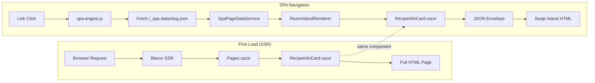
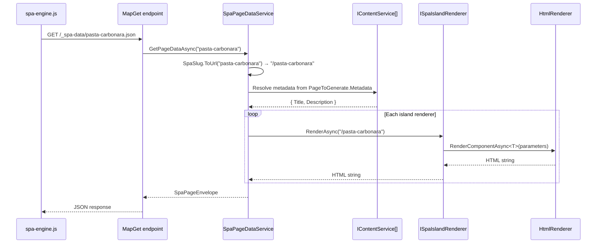
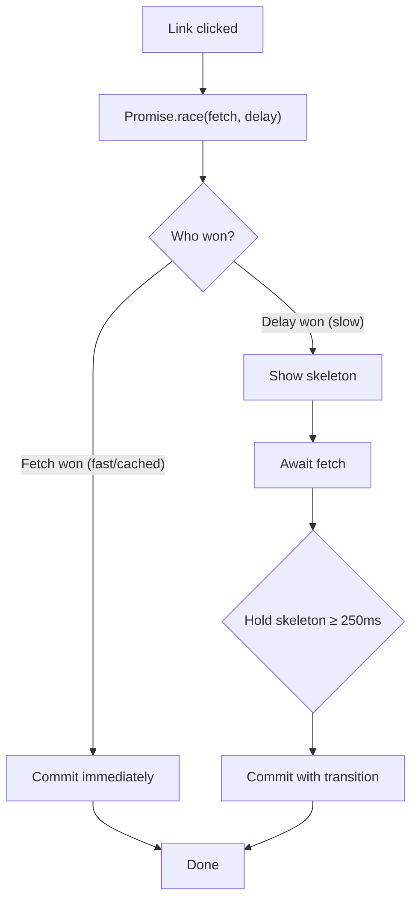

MyLittleContentEngine generates fully static HTML. Every page works without JavaScript — search engines
index it, browsers render it, and users read it. Razor Islands add a layer on top: after the first page
load, subsequent navigations swap just the dynamic regions (islands) without a full reload.

This page explains how that works end-to-end.

## The Two Rendering Paths

Every island has a single Razor component that serves both paths. There is no separate "SPA template" —
the same `RecipeInfoCard.razor` renders during Blazor SSR (first load) and via `HtmlRenderer` (SPA
navigation). This is the key architectural decision that keeps the system simple.



### Path 1: Static SSR

On the first page load, the standard Blazor SSR pipeline renders `Pages.razor`. The page component uses
the island's Razor component directly:

```razor
<RecipeInfoCard PrepTime="@fm.PrepTime" CookTime="@fm.CookTime" ... />
```

The browser receives a complete HTML page. No JavaScript needed.

### Path 2: SPA Navigation

When a user clicks an internal link, `spa-engine.js` intercepts the click and fetches the page's JSON
envelope from `/_spa-data/{slug}.json`. On the server, `SpaPageDataService` calls each registered
`ISpaIslandRenderer`, which renders the same Razor component to a string via Blazor's `HtmlRenderer`.
The client receives a small JSON payload and swaps the island contents in-place.

## Server-Side Flow

### Request Processing

When the `/_spa-data/{slug}` endpoint receives a request:



### Slug Resolution

The SPA engine uses **slugs** (URL paths without the leading slash, with `"index"` for root) as the
transport format between client and server. The `SpaSlug` utility converts between slugs and content URLs:

| Direction | Example | Used by |
|-----------|---------|---------|
| URL → slug | `"/pasta-carbonara"` → `"pasta-carbonara"` | `SpaNavigationContentService` (static generation) |
| Slug → URL | `"pasta-carbonara"` → `"/pasta-carbonara"` | `SpaPageDataService` (before calling renderers) |

Island renderers never see slugs — they receive content URLs. The slug is an internal detail of the
transport layer.

### ComponentRenderer and HtmlRenderer

`RazorIslandRenderer<T>` uses a scoped `ComponentRenderer` service that wraps Blazor's `HtmlRenderer`.
The scoped lifetime means one `HtmlRenderer` instance is shared across all island renders within a single
request, then disposed at scope end.

Components rendered this way have access to `@inject` services from the DI container. They do **not** have
access to `NavigationManager`, JavaScript interop, or other browser-dependent APIs — this is server-side
string rendering, not an interactive Blazor circuit.

### Multiple Renderers per Island

When multiple renderers declare the same `IslandName`, `SpaPageDataService` only runs the **last registered
one**. This is how custom renderers override built-in behaviour — the DI container preserves registration
order, and the service groups renderers by name and takes the last in each group.

## Client-Side Flow

### The Fetch Race

`spa-engine.js` races the JSON fetch against a configurable delay (default 100ms):



- **Fast path**: Cached or fast responses arrive before the delay. Content commits immediately with a view
  transition — no skeleton flicker.
- **Slow path**: If the delay wins the race, a skeleton appears. Once the fetch completes, the skeleton is
  held for a minimum duration (default 250ms) to avoid a sub-frame flash, then the real content commits.

### Island Discovery

On each navigation, the engine queries the DOM for `[data-spa-island]` elements and builds a map of island
name → element. Each discovered island gets an auto-assigned `view-transition-name` (e.g.
`spa-island-content`) so view transitions animate each island independently.

### Content Injection

After the JSON arrives, the engine iterates `data.islands` and sets `innerHTML` on the matching DOM
element. Islands present in the JSON but absent from the DOM are silently ignored (and vice versa). This
means the server can produce islands that only some layouts consume.

### Lifecycle Events

After injection, the engine fires `spa:commit` on `document`. This is the integration point for
site-specific features. DocSite's `spa-init.js` listens for this event to:

1. Reinitialise syntax highlighting, tabs, and mermaid diagrams
2. Rebuild the page outline from the new article's headings
3. Update the active navigation link
4. Set extended meta tags (`og:title`, `twitter:title`)
5. Reload the development stylesheet (MonorailCSS hot reload)

The engine itself handles `document.title`, `meta[name="description"]`, history (`pushState`/`popstate`),
and scroll position. Site-specific hooks handle everything else.

## Static Generation

During `dotnet run -- build`, the content engine generates static files. `SpaNavigationContentService`
participates in this process by registering a `/_spa-data/{slug}.json` page for every HTML page across
all registered content services. The generation pipeline fetches these URLs from the running Blazor app (just like it fetches HTML
pages), producing static JSON files alongside the HTML output.

The result is a fully static site where both HTML pages and SPA data files are pre-generated. No server
needed at runtime — a CDN or static file host serves everything.

```
output/
├── index.html
├── pasta-carbonara/index.html
├── _spa-data/
│   ├── index.json
│   └── pasta-carbonara.json
└── styles.css
```

## Fallback Behaviour

The SPA engine falls back to a full page load when:

- The `/_spa-data/{slug}.json` fetch returns a non-200 status (e.g. the page has no JSON — API reference
  pages, custom Razor pages)
- No `data-spa-island` elements exist in the current layout
- The link has `target="_blank"`, a `download` attribute, or modifier keys are held (Ctrl/Cmd+click)
- The link is a hash-only anchor (`#section`) on the current page

This makes SPA navigation **progressive enhancement** — it improves the experience when available but never
breaks navigation when it isn't.
