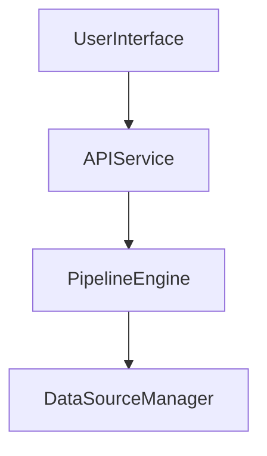

> **In this page.** Authoring Mermaid blocks with `mermaid` fences and how the diagram renders client-side with theme awareness.
>
> **Not in this page.** Server-side diagram rendering, non-Mermaid diagram systems, or embedding raw SVG.

## When to use this

- You are writing a markdown page and want to embed a flowchart, sequence, or state diagram inline.
- You want the diagram to re-theme automatically when the reader toggles between light and dark mode.
- You do not want to hand-write SVG or bring a custom rendering toolchain.

## Assumptions

- You have an existing Pennington site wired with `AddPennington` or a template that includes `Pennington.UI` (DocSite or BlogSite).
- Your layout includes the `Pennington.UI` `scripts.js` bundle (DocSite / BlogSite ship it by default).
- Readers have JavaScript enabled — diagrams are rendered client-side, on demand, via the Mermaid CDN module.
- To copy a working setup, see `examples/UserInterfaceExample` (its `Content/index.md` contains a live Mermaid fence).

---

## Steps

### 1. Add a fenced code block with the `mermaid` language tag

- Use a triple-backtick fence and set the language to `mermaid`.
- Put valid Mermaid syntax on the lines inside — flowchart, sequence, state, class, etc.
- Leave a blank line before and after the fence so Markdig treats it as its own block.

```markdown

```

### 2. Keep the diagram source small and self-contained

- One diagram per fence — do not concatenate multiple graphs in one block.
- Reference names inside the diagram are local to it; no cross-fence linking.
- Avoid HTML inside the fence body — the highlighter treats it as plain text and the renderer expects Mermaid syntax.

### 3. Reference a working fence from the examples tree

- `examples/UserInterfaceExample/Content/index.md` contains a live `graph TD` fence you can copy verbatim.
- The raw file is safe to embed as a full-file fence when illustrating a complete page:

```markdown:path
examples/UserInterfaceExample/Content/index.md
```

### 4. Verify theme awareness works

- The `MermaidManager` in `Pennington.UI/wwwroot/scripts.js` subscribes to the theme toggle.
- When `ThemeManager` flips `document.documentElement.classList` between `light`/`dark`, `reinitializeForTheme()` re-renders every tracked diagram with a fresh Mermaid config.
- No author action is required — diagrams re-theme automatically on toggle.

### 5. Do not server-render or pre-rasterize

- Mermaid is loaded dynamically from `cdn.jsdelivr.net/npm/mermaid@11` on first diagram encounter.
- There is no build-time SVG emission; the source text is shipped verbatim inside `<code class="language-mermaid">`.
- If you need a static SVG, author it as a raw `` or inline SVG — that is a different page.

---

## Verify

- Run `dotnet run --project docs/Pennington.Docs` and open the page in a browser.
- Expect the fenced block to be replaced by a rendered SVG inside `div.mermaid-diagram`.
- Toggle the theme; the diagram should re-render using the new palette without a page reload.

## Related

- Reference: [Markdown extensions](/reference/markdown/extensions)
- Reference: [Pennington.UI client scripts](/reference/ui/scripts)
- Background: [Why diagrams render client-side](/explanation/architecture/client-rendering)
