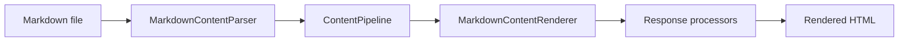
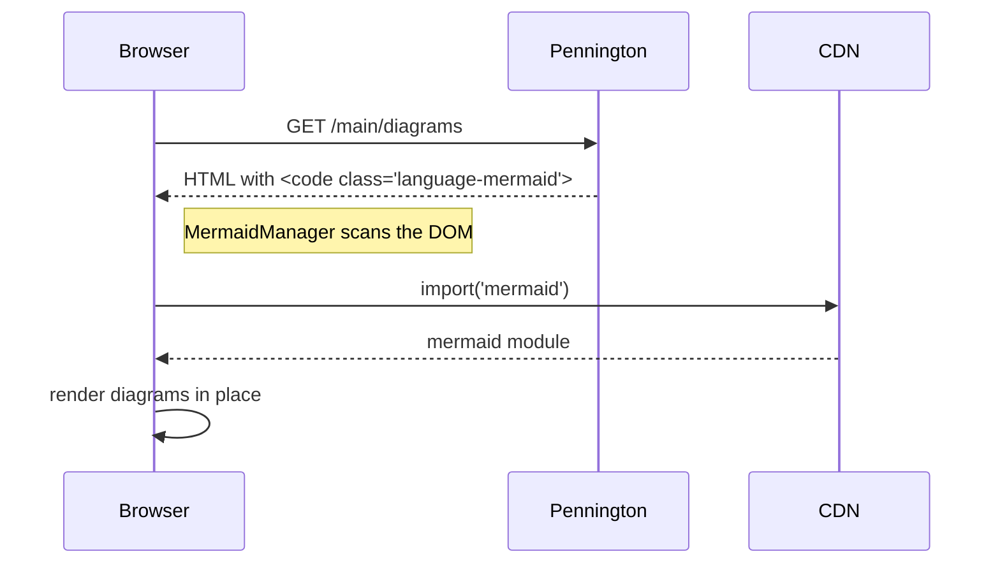

To drop a flowchart, sequence diagram, or other visual into a markdown article without authoring SVG by hand, fence the diagram with `mermaid` as the language. The DocSite ships a client script (`MermaidManager` in `Pennington.UI/wwwroot/scripts.js`) that scans the DOM for `code.language-mermaid` on page load, lazy-loads Mermaid from CDN, and swaps each `<code>` block for the rendered SVG. The same script re-renders every diagram when the theme toggle flips light or dark. For the fence info-string grammar, see <xref:reference.markdown.code-block-args>.

## Assumptions

- An existing Pennington site renders markdown (see <xref:tutorials.getting-started.first-site> if not).
- The host uses `AddDocSite` or `AddBlogSite`, or otherwise serves the Pennington.UI script bundle that includes `MermaidManager` — see [Bare-host wiring](#bare-host-wiring) below.
- Basic Mermaid syntax (flowchart, sequence, class, etc.) is familiar — this page does not teach Mermaid; see the [upstream Mermaid docs](https://mermaid.js.org/) for the grammar.

### Bare-host wiring

`AddDocSite` and `AddBlogSite` include `Pennington.UI` and reference its script bundle from the built-in layout. On a bare-`AddPennington` host the bundle still ships as a static web asset — add a package reference to `Pennington.UI` in the host csproj and emit this one `<script>` tag from your layout:

```html
<script type="module" src="/_content/Pennington.UI/scripts.js" defer></script>
```

`MermaidManager` auto-bootstraps on load, scans for `code.language-mermaid`, and takes over every fenced diagram in the rendered HTML. The same path serves the Pennington.UI stylesheet (`/_content/Pennington.UI/styles.css`) if the layout doesn't already pull it in through MonorailCSS.

## Diagram syntaxes

Each H3 below shows the markdown source above the rendered diagram. Pennington does not preprocess the body, so anything valid in Mermaid works as is.

### Flowchart

Fence a block with `mermaid` as the language and write a `flowchart` body. The client script swaps the `<code>` element for an SVG at page load.

````markdown

````


### Sequence diagram

Sequence diagrams use the same `mermaid` fence with a `sequenceDiagram` body.

````markdown

````


## What the renderer emits

CommonMark keeps each fence as `<pre><code class="language-mermaid">…</code></pre>` in the rendered HTML. The body is verbatim — Pennington does not transform it server-side. At page load, `MermaidManager` walks the DOM, dynamically imports Mermaid from `cdn.jsdelivr.net` the first time a diagram appears, and replaces every matching `<code>` element with an inline SVG. When the theme toggle changes, `MermaidManager.reinitializeForTheme()` reinitialises Mermaid with the matching built-in theme (`default` vs. `dark`) and re-renders every diagram in place. Diagrams render on both the live dev server and the static build output; the client-side script walks the DOM either way.

For per-diagram theme overrides, use Mermaid's inline `%%{init: { 'theme': '…' } }%%` directive at the top of the fence body — that is Mermaid syntax, not Pennington syntax.

## Related

- Reference: [Markdown extensions catalog](xref:reference.markdown.extensions) — the full list of non-CommonMark features, for context on what Pennington does and does not preprocess
- Reference: [Code-block argument reference](xref:reference.markdown.code-block-args) — the info-string grammar (`mermaid` is a bare language token, no arguments needed)
- How-to: <xref:how-to.content-authoring.alerts> — the neighbouring visual-element authoring surface, for comparison
- Background: [MonorailCSS integration](xref:explanation.rendering.monorail-css) — how the DocSite's theme tokens (the same ones Mermaid tracks) are generated
