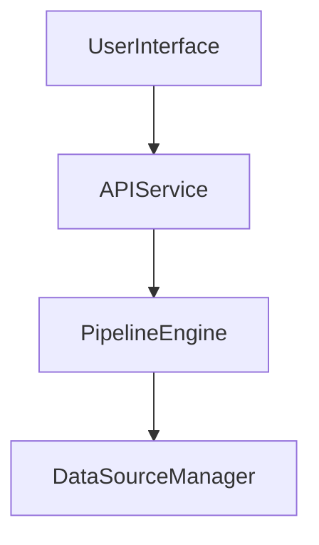

> **In this page.** Authoring Mermaid blocks with `mermaid` fences and how the diagram renders client-side with theme awareness.
>
> **Not in this page.** Server-side diagram rendering, non-Mermaid diagram systems, or embedding raw SVG.

## When to use this

When you want to embed a flowchart, sequence, or state diagram inline in a markdown page and have it re-theme automatically when the reader toggles between light and dark mode.

## Assumptions

- You have an existing Pennington site wired with `AddPennington` or a template that includes `Pennington.UI` (DocSite or BlogSite).
- Your layout includes the `Pennington.UI` `scripts.js` bundle (DocSite and BlogSite ship it by default).
- Readers have JavaScript enabled — diagrams render client-side on demand via the Mermaid CDN module.

To copy a working setup, see `examples/UserInterfaceExample` — its `Content/index.md` contains a live Mermaid fence.

---

## Steps

### 1. Add a fenced code block with the `mermaid` language tag

Use a triple-backtick fence with the language set to `mermaid`. Put valid Mermaid syntax on the lines inside — flowchart, sequence, state, class, etc. Leave a blank line before and after the fence so Markdig treats it as its own block.

```markdown

```

### 2. Keep the diagram source small and self-contained

One diagram per fence — do not concatenate multiple graphs in one block. Reference names inside the diagram are local to it; there is no cross-fence linking. Avoid HTML inside the fence body.

### 3. Copy a working fence from the examples tree

`examples/UserInterfaceExample/Content/index.md` contains a live `graph TD` fence you can copy verbatim:

```markdown:path
examples/UserInterfaceExample/Content/index.md
```

### 4. Theme awareness is automatic

When the theme toggles between light and dark, every tracked diagram re-renders with a fresh Mermaid config. No author action is required. Mermaid is loaded dynamically from `cdn.jsdelivr.net/npm/mermaid@11` on the first diagram encounter, so there is no build-time SVG emission. If you need a static SVG, author it as a raw `` or inline SVG.

---

## Verify

- Run `dotnet run --project docs/Pennington.Docs` and open the page in a browser.
- Expect the fenced block to be replaced by a rendered SVG inside `div.mermaid-diagram`.
- Toggle the theme; the diagram should re-render using the new palette without a page reload.

## Related

- Reference: [Markdown extensions catalog](/reference/markdown/extensions)
- Reference: [Utility components](/reference/ui/utility)
- Background: [MonorailCSS integration](/explanation/rendering/monorail-css)
