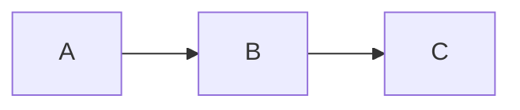

> **In this page.** Implementing `ICodeBlockPreprocessor`, setting a priority, parsing a language modifier (e.g. `mermaid`, `csharp:xmldocid`), and returning a `CodeBlockPreprocessResult` with `SkipTransform` when the output is already a terminal HTML block.
>
> **Not in this page.** Writing a new `ICodeHighlighter` (see the next how-to) or customizing the rendered CSS wrapper.

> **Grounding note.** The only shipped `ICodeBlockPreprocessor` in the repo is `Pennington.Roslyn.Preprocessing.RoslynCodeBlockPreprocessor` (registered by `AddPenningtonRoslyn`). There is no user-authored preprocessor under `examples/` yet (see `docs/_research/blockers.md`). The steps below describe the contract and the shape of a correct implementation; a grounding example should be added before the page is finalized.

## When to use this

- You have a fenced language (e.g., `mermaid`, `dot`, a DSL) that should render to a bespoke HTML block — not go through the standard syntax-highlighting path.
- You want to intercept a **language modifier** (e.g., `csharp:xmldocid`, `yaml:expand`) without claiming the base language — the preprocessor handles only the modifier form and lets the built-in highlighter handle plain ` ```csharp `.
- You want your output to bypass `CodeTransformer` (the component that applies line-highlight / diff / focus annotations) because you are emitting a terminal HTML block.

## Assumptions

- Bullets to cover under Assumptions:
- You have an existing Pennington site wired with `AddPennington` + `UsePennington`.
- You know which fenced form (`language`, `language:modifier`, or a stand-alone language like `mermaid`) you want to intercept.
- You are comfortable emitting wrapped `<pre><code>…</code></pre>` HTML and setting the final `class` names yourself.

To study a working implementation, read [`src/Pennington.Roslyn/Preprocessing/RoslynCodeBlockPreprocessor.cs`](https://github.com/scottsauber/Penn/blob/main/src/Pennington.Roslyn/Preprocessing/RoslynCodeBlockPreprocessor.cs) — it demonstrates modifier parsing, priority, and DI-backed services.

---

## Steps

### 1. Implement `ICodeBlockPreprocessor`

- Create a class implementing `Pennington.Markdown.Extensions.ICodeBlockPreprocessor`.
- Decide what your preprocessor claims — a **language** (e.g., `mermaid`), a **modifier suffix** (e.g., `:expand` after any base language), or a specific **pair** (e.g., `yaml:expand`).
- Return `null` from `TryProcess` when the language / modifier does not match — the next preprocessor (or the highlighter chain) takes over.

```csharp
public sealed class MermaidCodeBlockPreprocessor : ICodeBlockPreprocessor
{
    public int Priority => 100;

    public CodeBlockPreprocessResult? TryProcess(string code, string languageId)
    {
        if (!string.Equals(languageId, "mermaid", StringComparison.OrdinalIgnoreCase))
            return null;

        var html = $"<pre class=\"mermaid\">{WebUtility.HtmlEncode(code)}</pre>";
        return new CodeBlockPreprocessResult(html, BaseLanguage: "mermaid", SkipTransform: true);
    }
}
```

### 2. Set `Priority` so your preprocessor wins or loses as intended

- Preprocessors run in descending `Priority` order. The first one to return non-null wins; the rest of the chain is skipped.
- Reference: `RoslynCodeBlockPreprocessor.Priority = 100`. Pick a value that slots your preprocessor before or after it as appropriate.
- If your preprocessor is a pure fallback (handles only when nothing else did), use a low value like `10`.

### 3. Return a `CodeBlockPreprocessResult`

- Record shape: `CodeBlockPreprocessResult(string HighlightedHtml, string BaseLanguage, bool SkipTransform = false)`.
- `HighlightedHtml` must be complete — the pipeline wraps your output verbatim; do **not** re-wrap it in another `<pre><code>` layer if you already emitted one.
- `BaseLanguage` drives the CSS `language-*` class used downstream if `SkipTransform` is `false`; set it to the underlying language so existing CSS rules still apply.
- Set `SkipTransform: true` when your HTML is already the final render (Mermaid SVG, a `<table>` block, a diff view) — this prevents `CodeTransformer` from parsing the string as code and applying line-annotation markup.

### 4. Register the preprocessor with DI

- Register as a singleton (or scoped) on `IServiceCollection` — the pipeline resolves `IEnumerable<ICodeBlockPreprocessor>` and composes them by `Priority`.
- For simple, parameterless preprocessors a single registration suffices; use constructor DI for services.

```csharp
services.AddPennington(penn =>
{
    // other configuration…
});
services.AddSingleton<ICodeBlockPreprocessor, MermaidCodeBlockPreprocessor>();
```

### 5. Author a fence and verify it resolves

- Author a fenced block using the language (or modifier form) your preprocessor claims.
- Rebuild and view the rendered page.

````markdown

````

---

## Verify

- Run `dotnet run` and open a page whose markdown contains a fence your preprocessor claims.
- View source: the rendered HTML should be exactly the HTML your preprocessor returned, wrapped in a fenced container — no `hljs-*` spans appearing unless you emitted them.
- Swap the language identifier to one your preprocessor does **not** claim and confirm the built-in highlighter (`TextMateHighlighter` / `ShellHighlighter` / `PlainTextHighlighter`) takes over, proving your `TryProcess` correctly returned `null`.
- If you set `SkipTransform: true`, confirm that line-annotation tokens like `{1,3}` in the fence info-string have no effect on the output.

## Related

- Related reference: [Highlighting interfaces](/reference/extension-points/highlighting) — `ICodeHighlighter`, `ICodeBlockPreprocessor`, `HighlightingService`.
- How-to: [Add a custom syntax highlighter](/how-to/extensibility/custom-highlighter) — use this when you want to handle a language end-to-end rather than claim a modifier.
- Background: [The syntax-highlighting cascade](/explanation/rendering/highlighting) — where preprocessors sit relative to highlighters in the chain.
