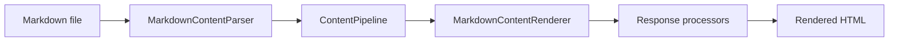
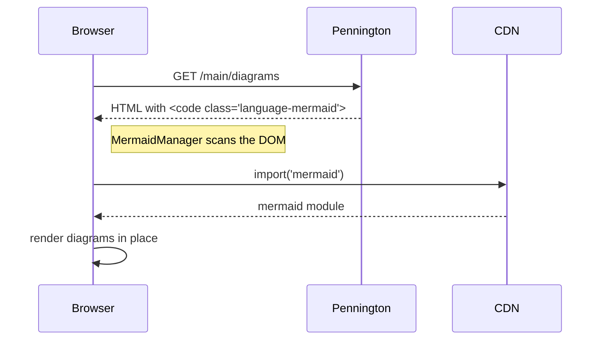

To drop a flowchart, sequence diagram, or other visual into a markdown article without authoring SVG by hand, fence the diagram with `mermaid` as the language. The DocSite's client script (`MermaidManager`) scans the DOM on page load, lazy-loads Mermaid from `cdn.jsdelivr.net`, and swaps each `<code>` block for the rendered SVG. Authoring sites that build offline or behind a firewall will need to vendor Mermaid themselves; the default CDN load fails silently otherwise.

## Before you begin
- An existing Pennington site renders markdown (see <xref:tutorials.getting-started.first-site> if not).
- The host uses `AddDocSite` or `AddBlogSite`, or — on a bare `AddPennington` host — references `Pennington.UI` and emits its script bundle from the layout (`<script type="module" src="/_content/Pennington.UI/scripts.js" defer></script>`).
- Familiarity with Mermaid syntax — this page covers the fence wiring, not Mermaid itself. See the [upstream Mermaid docs](https://mermaid.js.org/) for the grammar.

## Diagram syntaxes

Pennington does not preprocess the fence body — anything valid in Mermaid renders as-is. The two most common shapes are below.

### Flowchart

Fence a block with `mermaid` as the language and write a `flowchart` body. The client script swaps the `<code>` element for an SVG at page load.

````markdown

````


### Sequence diagram

Sequence diagrams use the same `mermaid` fence with a `sequenceDiagram` body.

````markdown

````


## What the renderer emits

Each fence renders as `<pre><code class="language-mermaid">…</code></pre>` with the body verbatim — Pennington does not transform it server-side. The client-side `MermaidManager` walks the DOM, dynamically imports Mermaid from `cdn.jsdelivr.net` the first time a diagram appears, and replaces every matching `<code>` element with an inline SVG. The theme toggle calls `MermaidManager.reinitializeForTheme()`, which reinitialises Mermaid with the matching built-in theme and re-renders every diagram in place. Diagrams render on both the live dev server and the static build output.

For per-diagram theme overrides, use Mermaid's inline `%%{init: { 'theme': '…' } }%%` directive at the top of the fence body — Mermaid syntax, not Pennington syntax.

## Related

- Reference: [Markdown extensions catalog](xref:reference.markdown.extensions) — the full list of non-CommonMark features, for context on what Pennington does and does not preprocess
- Reference: [Code-block argument reference](xref:reference.markdown.code-block-args) — the info-string grammar (`mermaid` is a bare language token, no arguments needed)
- How-to: <xref:how-to.rich-content.alerts> — the neighbouring visual-element authoring surface, for comparison
- Background: [MonorailCSS integration](xref:explanation.rendering.monorail-css) — how the DocSite's theme tokens (the same ones Mermaid tracks) are generated
