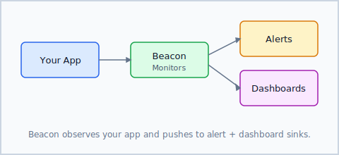

## Installation

```shell
dotnet add package Beacon
```

## Create Your First Monitor

```csharp
using Beacon;

var monitor = new HttpMonitor("https://api.example.com/health");
monitor.Interval = TimeSpan.FromMinutes(1);
monitor.OnFailure += (sender, e) =>
    Console.WriteLine($"Alert: {e.StatusCode} at {e.Timestamp}");

await monitor.StartAsync();
```

> [!NOTE]
> Beacon requires .NET 9 or later.

See the [Configuration](xref:beacon.configuration) guide for retry policies and alert thresholds.


