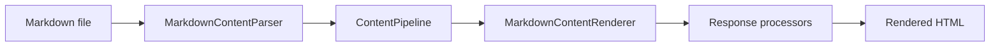
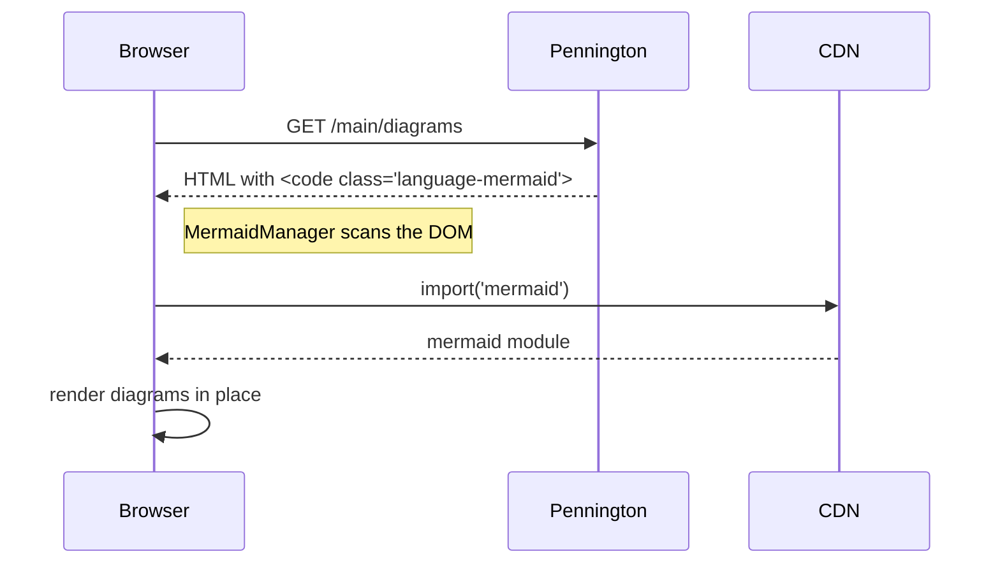

Fence a block with the `mermaid` language and the DocSite's bundled
`MermaidManager` picks it up at page load, lazy-loads mermaid from CDN,
and replaces the `<code>` element with the rendered SVG. Theme changes
(light / dark) trigger a re-render with a matching mermaid theme.

Sequence diagrams work the same way:

Diagrams render on both the live dev server and the static build output;
the client-side script walks the DOM either way.
